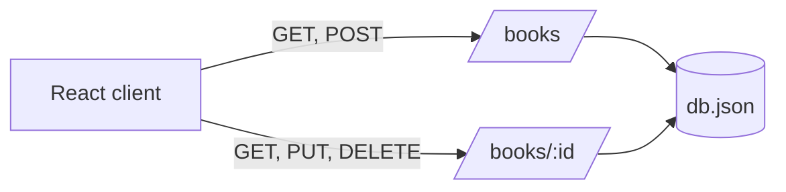

# API Reference

## Overview

The frontend calls JSON Server at `http://localhost:3000`. The application uses the `books` resource and sends JSON request bodies for create and update operations.



There is no API authentication, version prefix, rate limit, or custom error contract implemented by this project.

## Resource shape

```json
{
  "id": "b8Lp3QaW5zN",
  "title": "The Pragmatic Programmer",
  "author": "Andrew Hunt",
  "genre": "Programming",
  "publishedYear": 1999,
  "price": 799
}
```

`id` is omitted when the frontend creates a book. Currency and price units are not specified by the implementation.

## Endpoints used by the frontend

| Method | Path | Purpose |
| --- | --- | --- |
| `GET` | `/books` | Retrieve all books. |
| `GET` | `/books/:id` | Retrieve one book for the edit page. |
| `POST` | `/books` | Create a book. |
| `PUT` | `/books/:id` | Replace a book with the submitted fields. |
| `DELETE` | `/books/:id` | Remove a book. |

### List books

```http
GET /books HTTP/1.1
Host: localhost:3000
```

The frontend expects a JSON array of book objects. A non-success response causes the hook to record `Failed to fetch`.

### Get one book

```http
GET /books/<id> HTTP/1.1
Host: localhost:3000
```

The edit route uses the ID from `/edit/:id` to load the record. A non-success response causes the hook to record `Failed to fetch book`.

### Create a book

```http
POST /books HTTP/1.1
Host: localhost:3000
Content-Type: application/json

{
  "title": "Example Book",
  "author": "Example Author",
  "genre": "Fiction",
  "publishedYear": 2024,
  "price": 299
}
```

The handler treats any successful response as a completed create and then refreshes its in-memory collection.

### Update a book

```http
PUT /books/<id> HTTP/1.1
Host: localhost:3000
Content-Type: application/json

{
  "title": "Example Book, Revised",
  "author": "Example Author",
  "genre": "Fiction",
  "publishedYear": 2024,
  "price": 349
}
```

This is a full replacement request, not a partial update. The client navigates to `/` after a successful response.

### Delete a book

```http
DELETE /books/<id> HTTP/1.1
Host: localhost:3000
```

The client refreshes its in-memory collection after a successful delete.

## Error handling

The client tests `response.ok` for each request. It stores errors internally but does not render messages to the user. Consumers should not rely on a custom error payload or status-code mapping beyond the behavior supplied by JSON Server.
