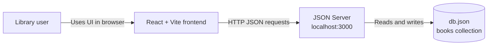
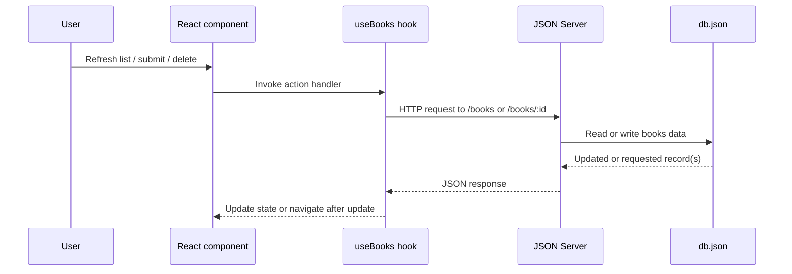

# Architecture

## Overview

The application is a browser-based React client that calls a local JSON Server REST API. JSON Server stores the `books` collection in `JSON server/db.json`. There is no separate custom backend or database service.

## System context

The browser and JSON Server run locally during development. The frontend uses a fixed API base URL of `http://localhost:3000`; therefore, the API must be running on that port for CRUD actions to work.

## Frontend components

| Component | Responsibility |
| --- | --- |
| `src/App.tsx` | Declares routes for the dashboard, add page, and edit page. |
| `src/Pages/Dashboard.tsx` | Shows the main navigation and collection view. |
| `src/components/DataDisplay.tsx` | Renders the book table; invokes refresh, edit, and delete actions. |
| `src/components/UserAddition.tsx` | Collects fields for a new book and invokes the create action. |
| `src/components/UserEdit.tsx` | Loads an existing book into inputs and invokes the update action. |
| `src/Hook/Fetch.ts` | Owns book/form state and sends CRUD requests. |

## Request flow

For the dashboard, the collection is loaded only when the user selects **Refresh list**. The add, delete, and update handlers re-use the same API base URL. A successful update navigates to the dashboard; a successful add displays a browser alert and refreshes the hook's in-memory list.

## Data model

The `books` array in `JSON server/db.json` is the persisted resource collection.

| Field | Type | Notes |
| --- | --- | --- |
| `id` | `string` or `number` | Resource identifier. JSON Server may generate an ID for a newly created record. |
| `title` | `string` | Book title. |
| `author` | `string` | Book author. |
| `genre` | `string` | Book genre. |
| `publishedYear` | `number` | Publication year. |
| `price` | `number` | Price value; currency is not defined by the application. |

## Constraints and known limitations

- The client has no authentication or authorization.
- Input fields have no required-field, range, or format validation beyond HTML `number` inputs for year and price.
- Errors are stored in hook state but are not displayed in the UI.
- The API URL is hard-coded; it cannot be configured with an environment variable.
- `db.json` is suitable for local development only and is not a multi-user database.
